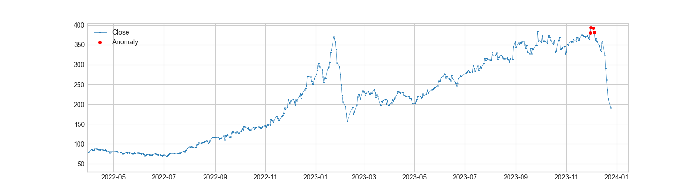
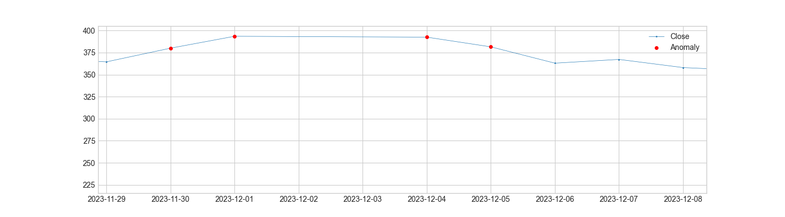
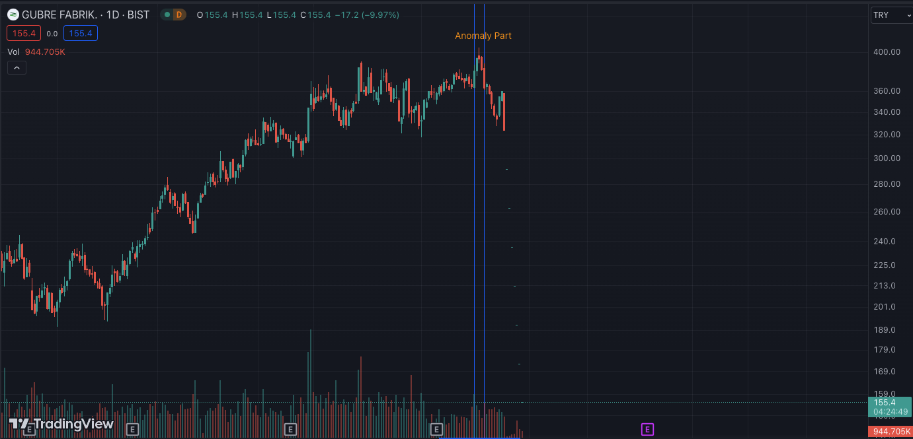

# Anomaly-Detection-Time-Series-Data

This project demonstrates anomaly detection in time series data using the ADTK (Anomaly Detection Toolkit) library.

## Overview

Anomaly detection in time series data is a crucial task in various domains, such as finance, healthcare, and industrial monitoring. This project utilizes the ADTK library, which provides a set of tools for anomaly detection in time series data. 

## Example 
In recent observations of GUBRF stock, we have identified anomalies indicative of significant events. 



Upon closer examination of historical data, we observe a predominant presence of selling activity during those periods.


 Notably, in the upcoming 20 days, there is an anticipated depreciation of the stock by over 50%.



**It is essential to note that these findings are for informational purposes only and do not constitute financial advice. Investors are encouraged to conduct thorough analyses and seek professional guidance before making any investment decisions.**

## Dataset

We will be dowload data from **yahoofinance** and also temperature data from [datahub](https://datahub.io/core/global-temp). 

## Important Note

I encountered an issue with the **seaborn-whitegrid** style while using plot function in the **adtk** package. To address this, I downloaded the entire package to my local environment and made necessary code modifications. Already submitted a pull request to the adtk team, but the changes have not been incorporated yet. If you are experiencing a similar problem, you can follow the same approach to resolve the issue.

## Environment

```BASH
pyenv local 3.11.3
python -m venv .venv
source .venv/bin/activate
pip install --upgrade pip
pip install -r requirements.txt
```

*Note: If there are errors during environment setup, try removing the versions from the failing packages in the requirements file.*

## Disclaimer

This project is for educational and demonstration purposes only. It is not financial advice. Always consult with a qualified financial advisor before making any investment decisions.
